# Travelogue

## Introduction
This is my graduation project named Travelogue. The goal of the app is to provide users with a comprehensive travel experience, helping them easily search, explore, and plan their trips.

## Key Features

- Automatically crawl travel location data from tourism websites

- Provide AI-powered tour recommendations (branch: show-tours-list-using-AI)

- Search for travel destinations based on various criteria

- Explore places, posts, and reviews from other users

- Plan personalized trips

- Manage travel history and reviews

- Cross-platform support (Android, iOS)

## Technologies Used

- Frontend: React Native

- Backend:  
  - Firebase Realtime Database, Firebase Storage, Firebase Authentication  
  - Python backend services using FastAPI for API development 
  - Machine Learning: Random Forest algorithm implemented in Python for tour recommendations

## Galleries
<!-- ### 📍 Home Screen 
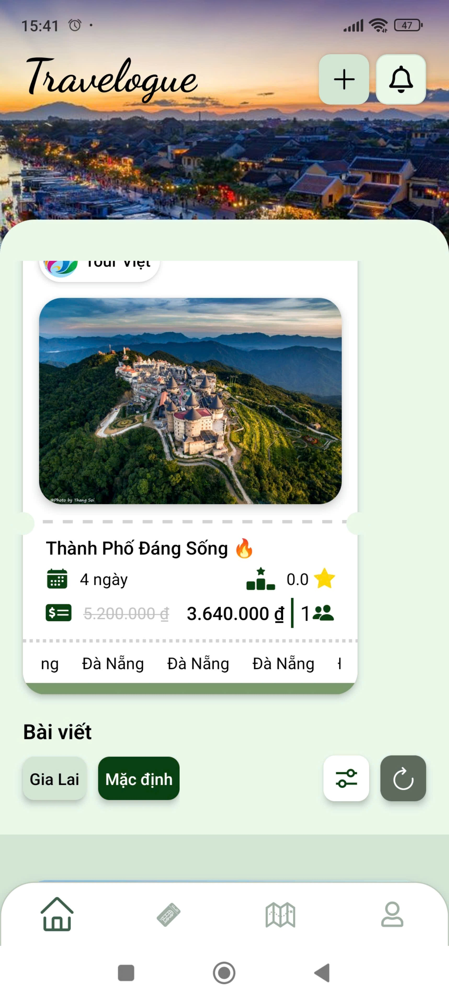
### 📍 Post Detail Screen 
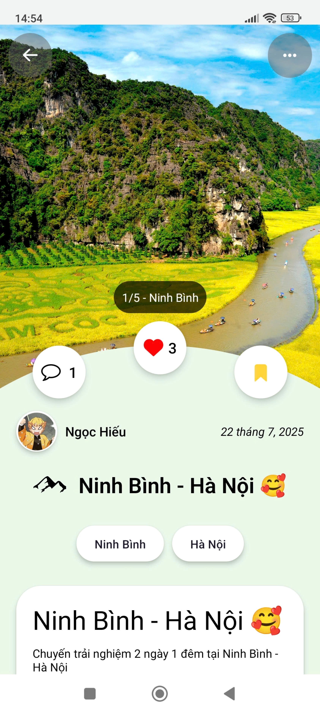
### 📍 Post Detail Screen 
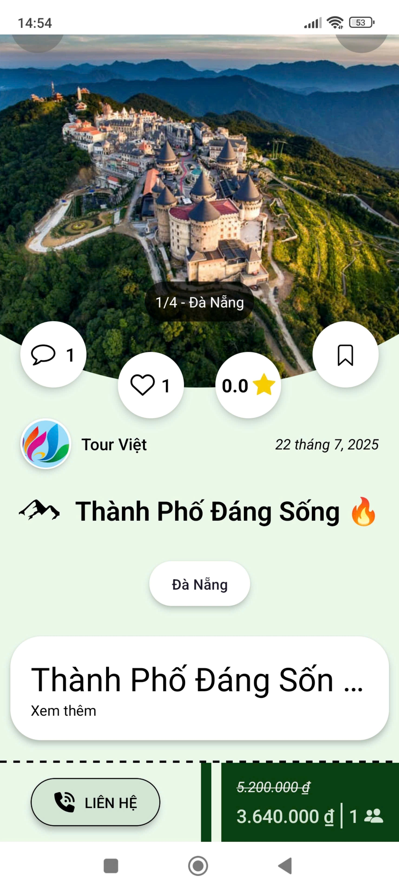
### 📍 Map Screen 
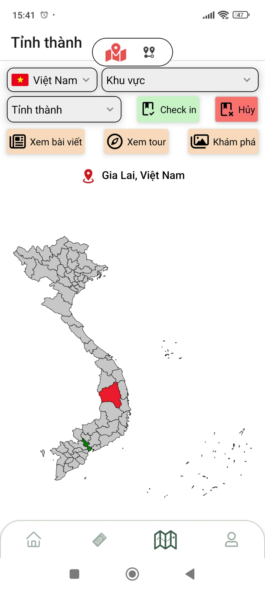
### 📍 Search Dialog 
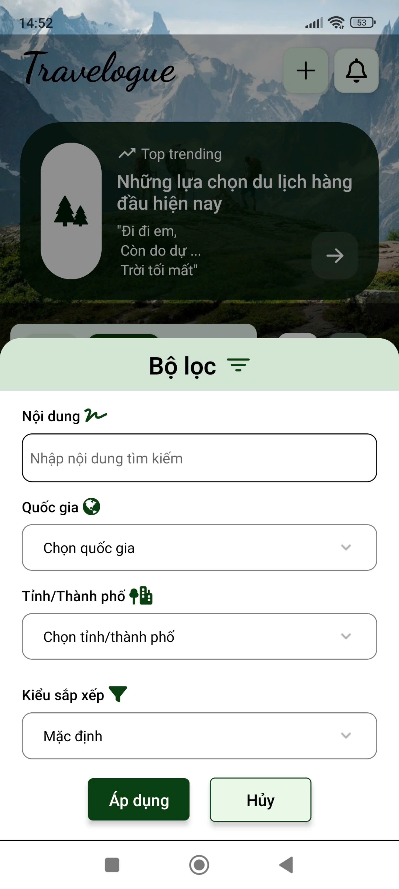
### 📍 Create Post Screen 
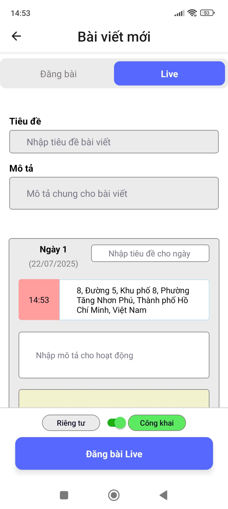
### 📍 Location Information Screen 
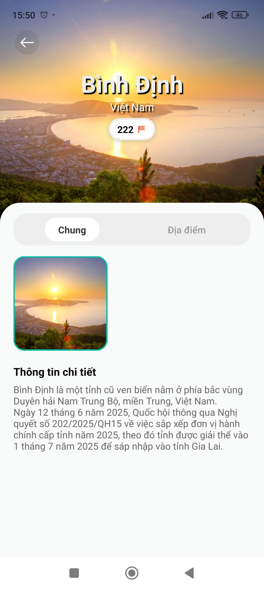
### 📍 Create Post Screen 
 -->

  
  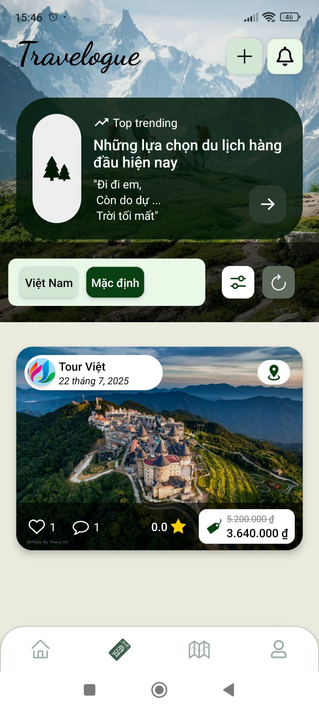
  
  
  
  
  
  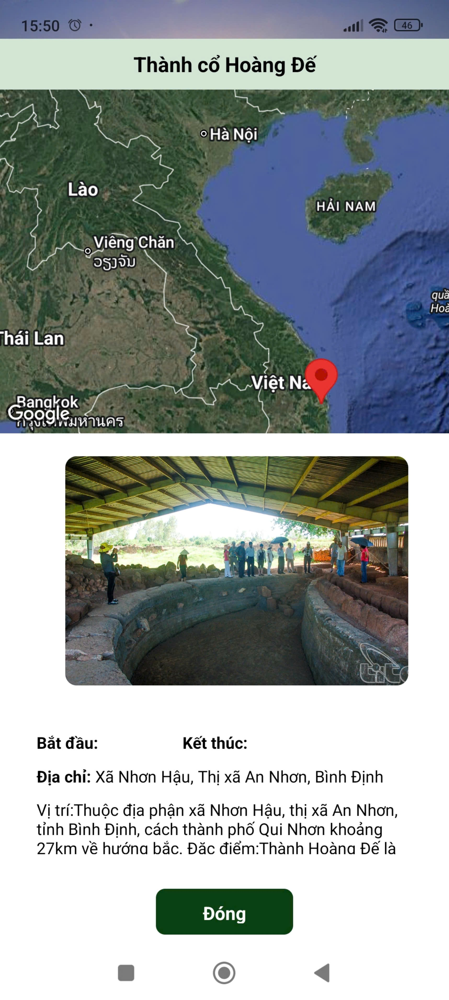
  
  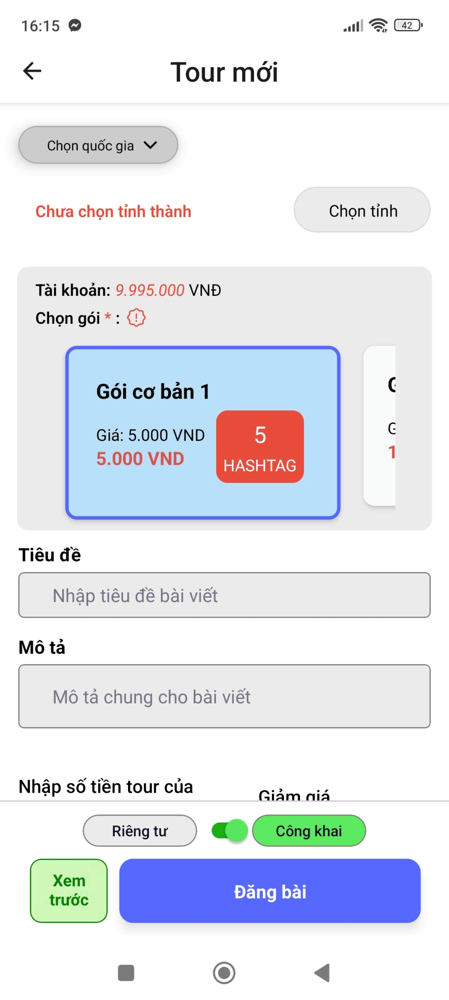
  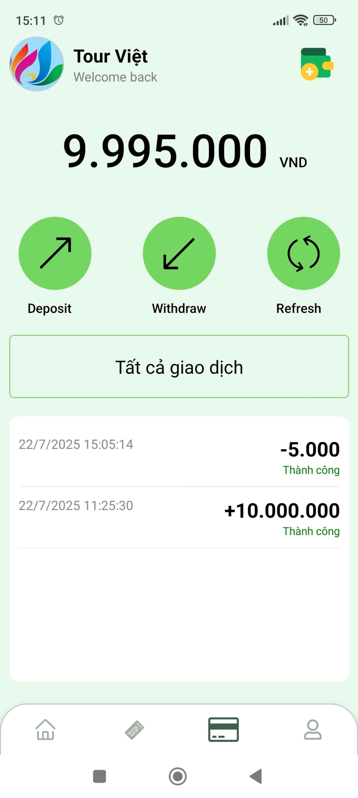
  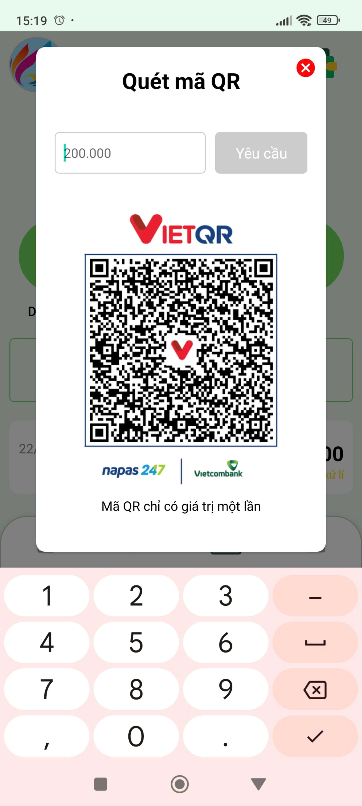
  
  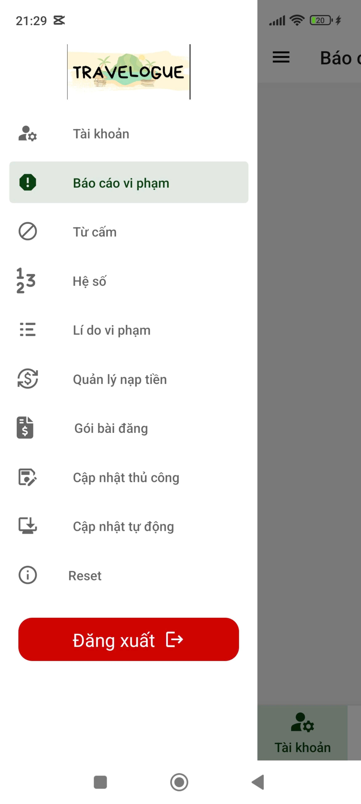
  
  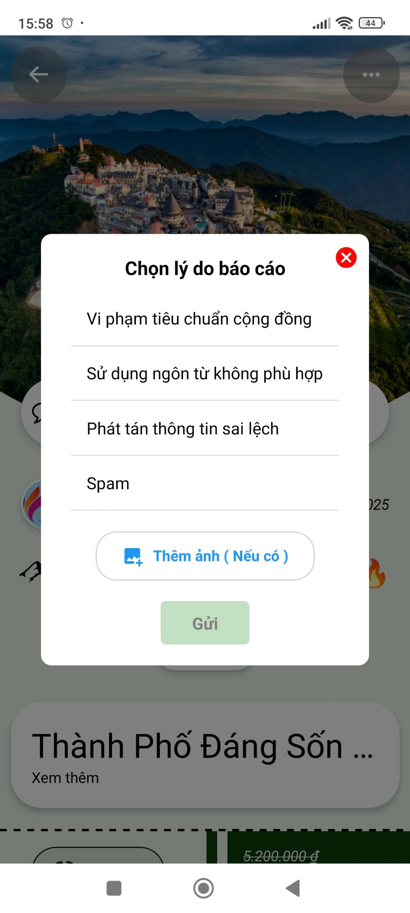
  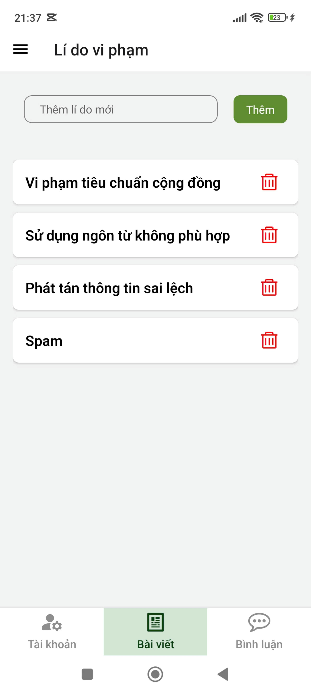
  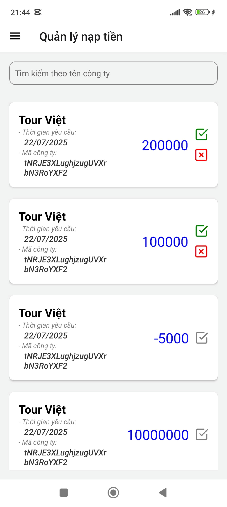
  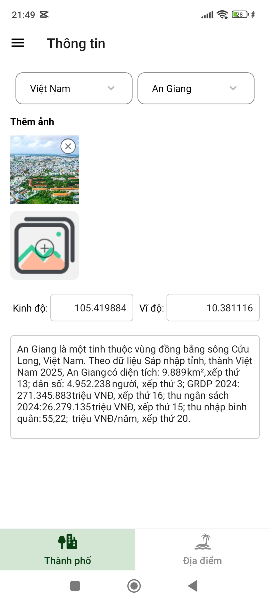
  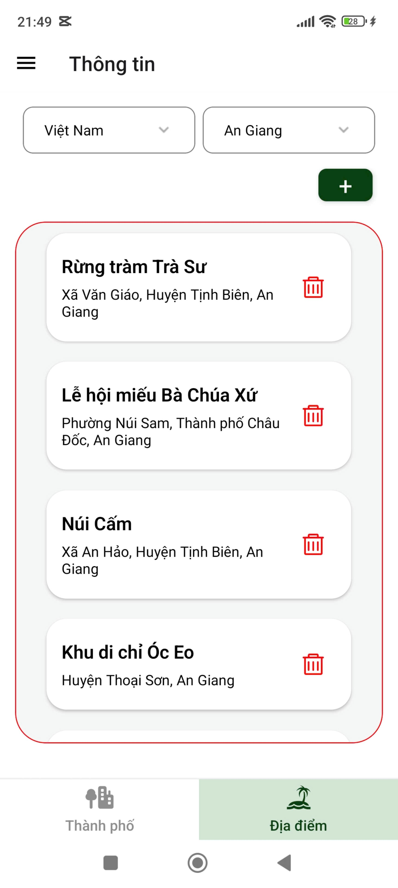
  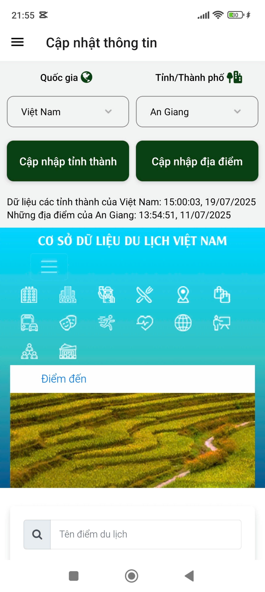

